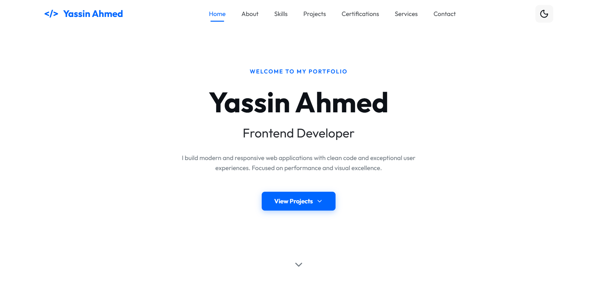
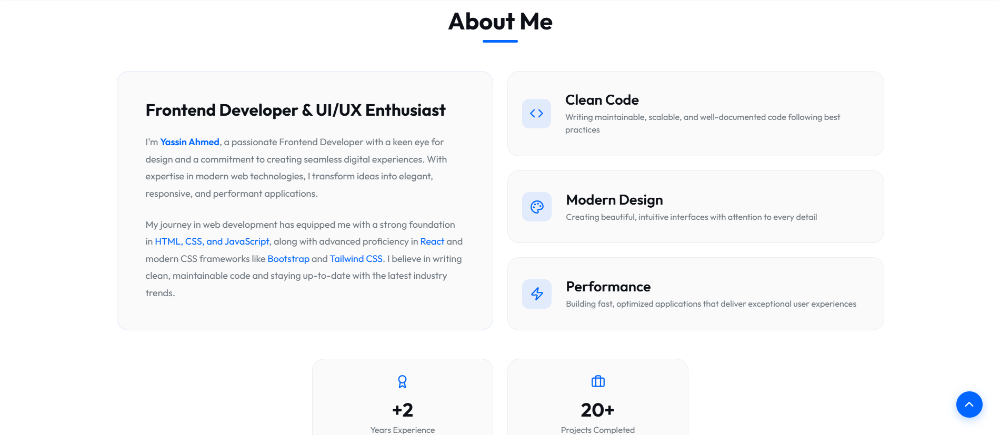
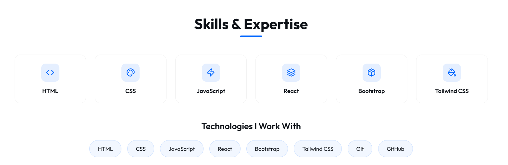
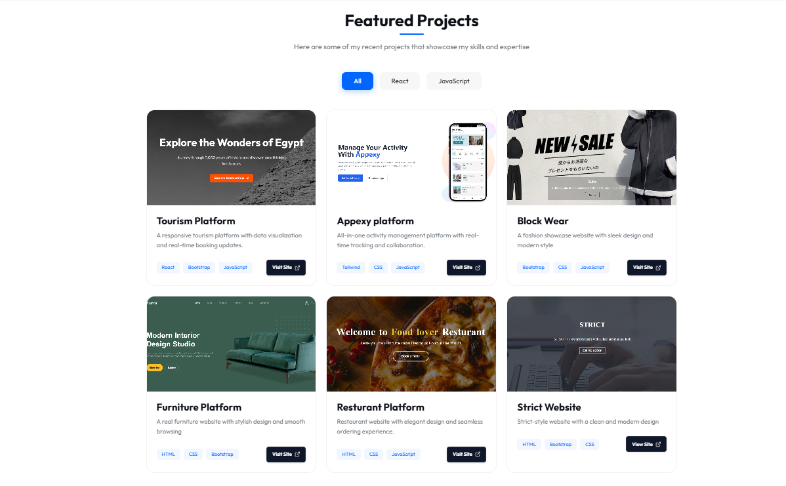
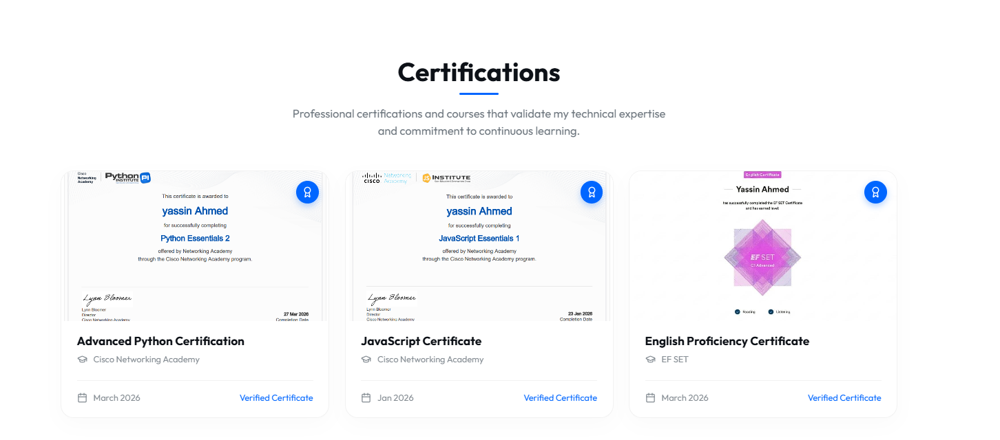
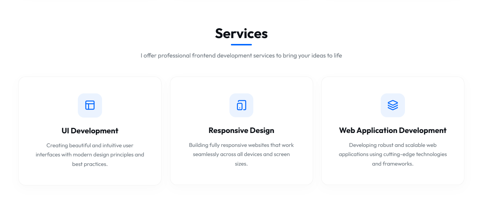
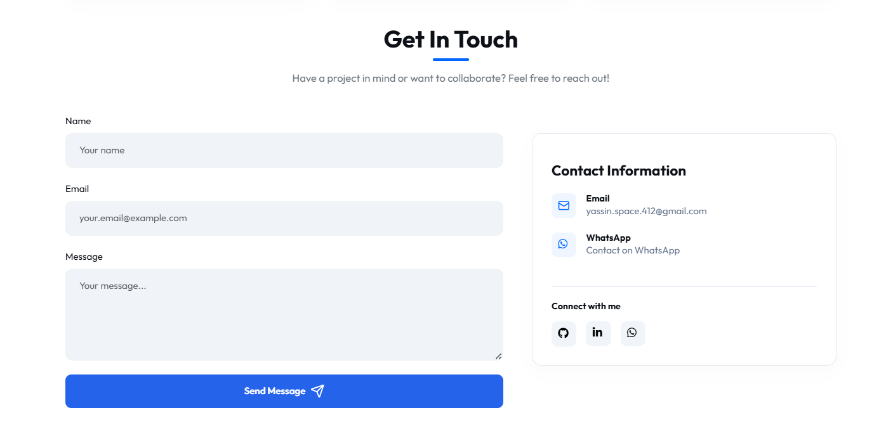

# Yassin Ahmed | Portfolio

## 📝 Description
A modern, responsive portfolio website designed to showcase my skills, projects, and professional certifications as a Frontend Developer. It features a clean UI, dark/light mode, and smooth animations.

## 🚀 Live Demo
You can view the live site here: [Live Demo Link](https://yassin-ahmed54.github.io/Portfolio-Website-Front-End-Project/)

## 🛠️ Technologies Used
- **HTML5 & CSS3** (Core structure and styling)
- **Bootstrap 5** (Responsive layout and components)
- **JavaScript** (Theme toggling and project filtering)
- **Lucide & Font Awesome** (Icons)
- **EmailJS** (Contact form integration)

## ✨ Features
- **Responsive Layout**: Works on mobile, tablet, and desktop.
- **Theme Toggle**: Switch between Light and Dark modes.
- **Project Filter**: Easily browse projects by category.
- **Contact Form**: Send messages directly to my email.
- **Scroll Animations**: Dynamic and engaging user experience.

## 📸 Screenshots

### Home


### About


### Skills


### Projects


### Certifications


### Services


### Contact


## ⚙️ Setup Instructions
1. **Clone the project**:
   ```bash
   git clone https://github.com/Yassin-Ahmed54/Portofolio.git
   ```
2. **Open the folder**:
   Navigate to the `Portofolio` directory.
3. **Launch**:
   Open `index.html` in your web browser.

## 🔮 Future Improvements
- [ ] Migrate the project to React for better scalability and component-based architecture.
- [ ] Add multi-language support (e.g., Arabic and English).
- [ ] Convert the project into a full-stack application with backend integration.

---
Created by [Yassin Ahmed](https://github.com/Yassin-Ahmed54)
